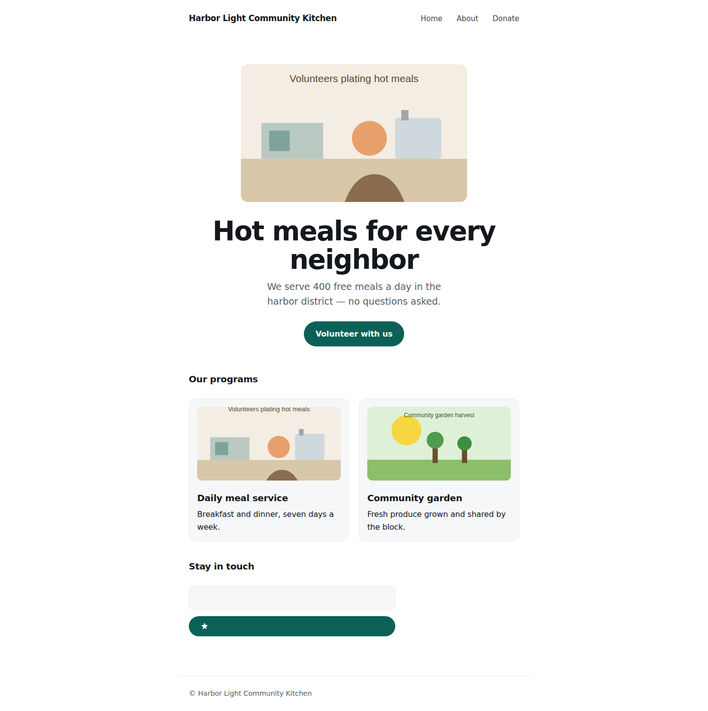
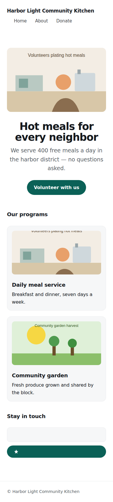
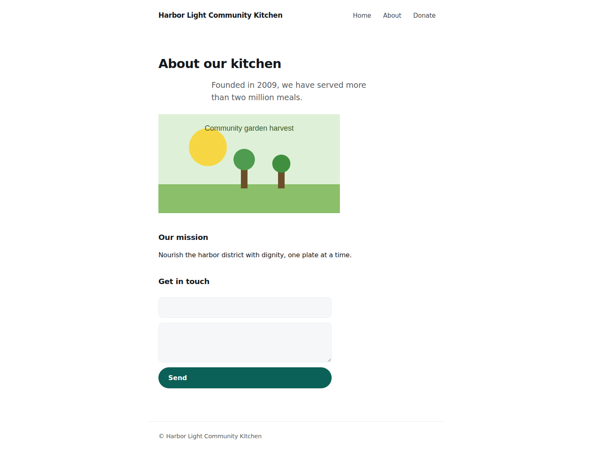
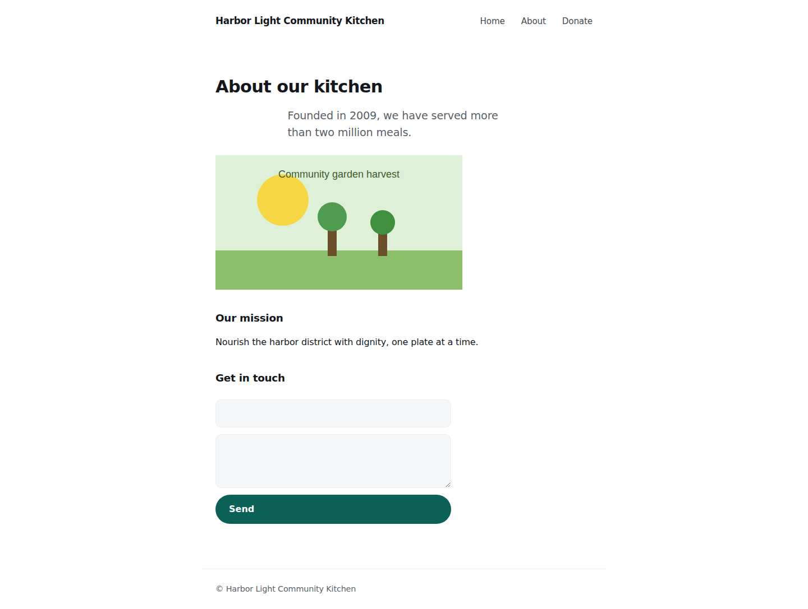
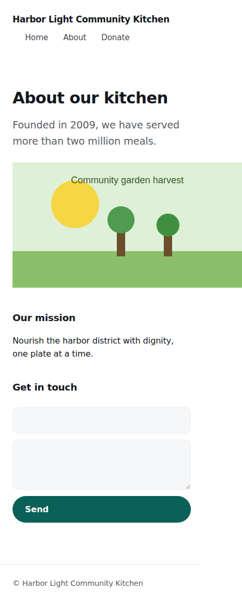
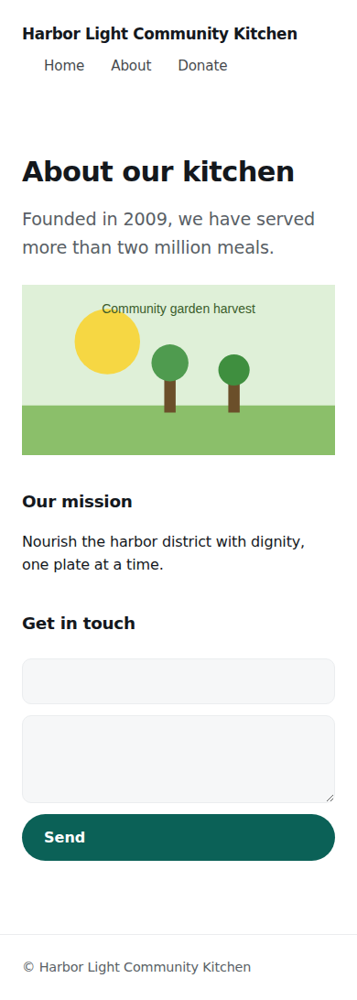

# Retrofit compliance report — i18n

**Target:** http://localhost:8080

**Baseline:** 63 violations · **After:** 0 violations

## Violations by rule

| Rule | Before | After |
| --- | ---: | ---: |
| `locale-completeness` | 63 | 0 |
| **Total** | **63** | **0** |

## Visual verification (Verifier B)

| Screenshot | Δheight | Signal |
| --- | ---: | --- |
| `about-desktop.png` | 0.6% | ✅ within threshold |
| `about-mobile.png` | 5.3% | ⚠️ review |
| `index-desktop.png` | 0.0% | ✅ within threshold |
| `index-mobile.png` | 0.0% | ✅ within threshold |

## Before / after screenshots

### `/index.html`

| before | after |
| --- | --- |
|  |  |

| before | after |
| --- | --- |
|  |  |

### `/about.html`

| before | after |
| --- | --- |
|  |  |

| before | after |
| --- | --- |
|  |  |

